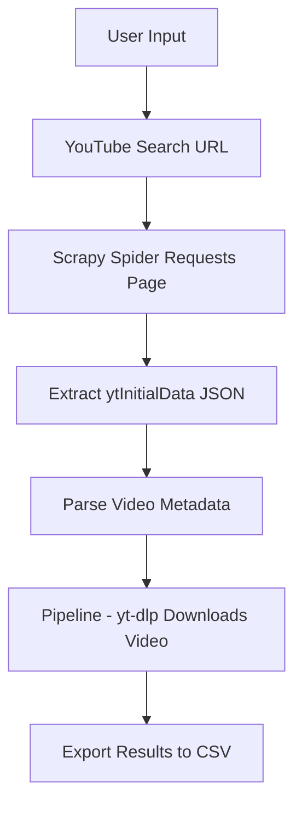

# 🎥 YouTube Scraper using Scrapy

A powerful YouTube scraping tool built with **Scrapy** and **yt-dlp** that:

- Fetches YouTube video data based on user-specified keywords  
- Extracts metadata (title, views, channel, description)  
- Downloads the corresponding videos automatically  
- Exports everything neatly into a **CSV file**

---

## 🚀 Features

✅ Extract video metadata from YouTube search results  
✅ Download videos automatically via **yt-dlp**  
✅ Save results to `videos.csv` (title, channel, views, description, video_url, local_path)  
✅ Random **User-Agent rotation** for anonymity  
✅ Automatic **proxy rotation** for bypassing IP limits  
✅ **Cloud-ready** design (can deploy on Zyte Scrapy Cloud or any VPS)

---

## 🧠 Project Workflow


## ⚙️ Installation

### Clone this repository
```bash
git clone https://github.com/YassirCodes/Youtube_Webscrape.git
cd Youtube_Webscraping
```

### Create a virtual environment
```bash
conda create -n ytscraper python=3.12
conda activate ytscraper
```

### Install dependencies
```bash
pip install scrapy yt-dlp requests
```

## Running the Spider

### Example

```bash
scrapy crawl youtube_json -a keyword="laptop" -a limit=10 -O laptop_videos.csv
```

## Output

This will:

1) Scrape top 10 videos about “laptop”
2) Download each video to the downloads/ folder
3) Save metadata in laptop_videos.csv

